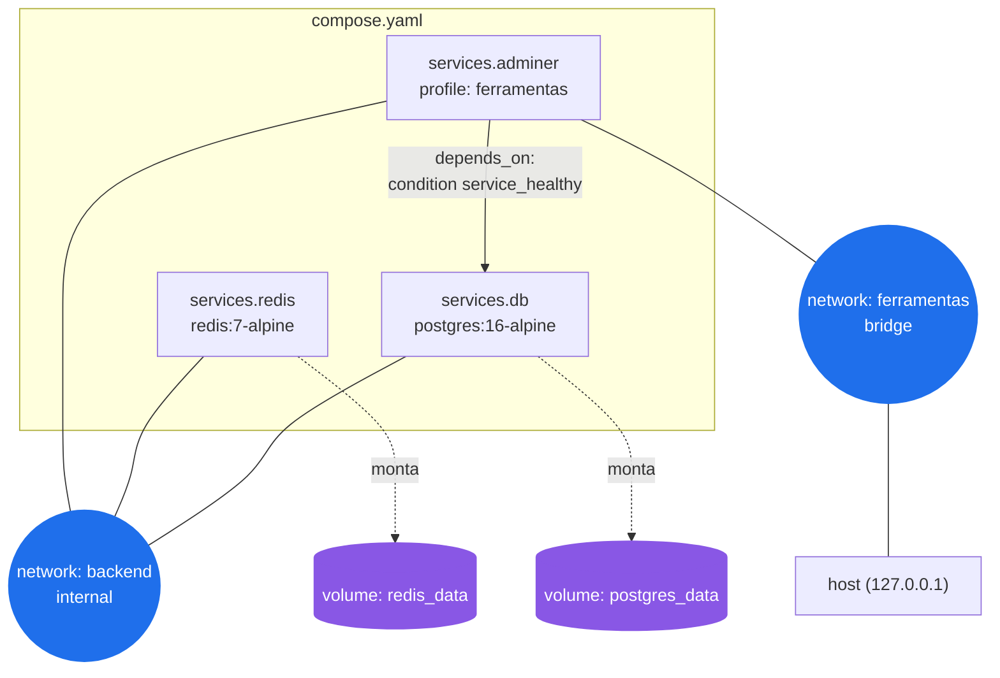

# Contexto e fundamentos do Docker Compose

Esta seção cobre a base conceitual do trabalho: de onde o Docker Compose veio, que
problema ele resolve e como seus mecanismos principais funcionam. As demais frentes do
repositório (análise crítica, comparações e exemplos práticos) partem dos conceitos
apresentados aqui.

- - -

## 0. O que é conteinerização e Docker

Para entender os fundamentos do Docker Compose, é necessário entender antes o que é
conteinerização. Ela surge num contexto em que era difícil manter a portabilidade de
sistemas entre ambientes diferentes — o clássico "na minha máquina funciona". Um container
empacota a aplicação junto com suas dependências (bibliotecas, runtime, configuração) num
único artefato que roda de forma isolada e idêntica em qualquer host com um motor de
containers instalado.

Diferente de uma máquina virtual, que virtualiza hardware inteiro e carrega um sistema
operacional próprio para cada instância, um container compartilha o kernel do sistema
operacional hospedeiro e isola apenas os processos (usando mecanismos do kernel Linux como
*namespaces* e *cgroups*). Isso o torna muito mais leve e rápido de iniciar do que uma VM.

De forma resumida, os containers existem para:

- empacotar aplicações junto com suas dependências;
- isolar dependências entre aplicações diferentes no mesmo host;
- garantir portabilidade entre ambientes (desenvolvimento, testes, produção);
- facilitar e acelerar a implantação.

O Docker é a plataforma open-source de conteinerização que popularizou esse modelo. Foi
lançado em março de 2013, na conferência PyCon [9]. Inicialmente, usava o LXC (*Linux
Containers*) como mecanismo de isolamento de processos; a partir da versão 0.9, em 2014, o
Docker passou a usar seu próprio componente, o **libcontainer**, escrito em Go, substituindo
a dependência do LXC [9][10]. Desde 2017, os componentes open-source do Docker Engine são
mantidos sob o guarda-chuva do **Moby Project**, criado pela Docker Inc. para separar o
projeto open-source dos produtos comerciais da empresa [11].

- - -

## 1. Origem e histórico

O Docker Compose não nasceu dentro da Docker Inc. Ele começou como **Fig**, uma ferramenta
de composição e orquestração de containers criada pela *Orchard Laboratories*, startup de
dois integrantes (Ben Firshman e Aanand Prasad) que já atuava na comunidade Docker
oferecendo um serviço hospedado de containers [3][8].

Em 23 de julho de 2014, a Docker Inc. anunciou a aquisição da Orchard [2][3]. O Fig foi
incorporado à linha de produtos da Docker e rebatizado como **Docker Compose**, mantendo os
mesmos autores como mantenedores centrais do projeto [3].

A partir daí, o formato de arquivo evoluiu em versões sucessivas:

| Formato | Característica |
|---|---|
| `docker-compose.yml` (sem chave `version`) | Formato original herdado do Fig |
| Compose file **v2** | Introduz a seção `services` explícita e separa `volumes`/`networks` no topo do arquivo |
| Compose file **v3** | Alinhado ao Docker Engine em modo *Swarm*, pensado também para orquestração multi-host |
| **Compose Specification** (`compose-spec`) | Unifica as versões anteriores; hoje a chave `version:` é apenas informativa — o Compose interpreta o arquivo pela sintaxe presente, não por um número de versão, e emite apenas um aviso de campo obsoleto se ela existir [5][6][7] |

Outra mudança relevante foi na própria ferramenta de linha de comando. O binário standalone
`docker-compose` (Compose V1, escrito em Python) foi substituído pelo plugin `docker compose`
(Compose V2, escrito em Go), integrado diretamente à CLI do Docker. O Compose V2 atingiu
disponibilidade geral em 26 de abril de 2022; a partir de junho de 2023 o V1 deixou de
receber suporte e de ser distribuído com o Docker Desktop, chegando ao fim de vida em maio
de 2024 [4]. Por isso, este trabalho usa exclusivamente a sintaxe atual, **`docker compose`**
(sem hífen), como já adotado nos exemplos práticos do repositório.

- - -

## 2. Por que o Compose existe — o problema que ele resolve

Antes do Compose, subir uma aplicação com múltiplos containers exigia orquestrar
manualmente uma sequência de comandos `docker run`, um para cada serviço, cuidando à mão de
detalhes como:

- criar uma rede específica e conectar cada container a ela, para que os serviços se
  encontrem pelo nome;
- criar e montar volumes para persistir dados entre reinícios;
- repetir variáveis de ambiente e opções de porta em cada comando;
- respeitar manualmente a ordem de inicialização (por exemplo, subir o banco antes da
  aplicação que depende dele).

Esse processo é repetitivo, difícil de reproduzir de forma idêntica em outra máquina e
propenso a erro humano — um comando esquecido ou uma flag diferente já quebra o ambiente.

O Compose resolve isso permitindo declarar **todos** esses aspectos em um único arquivo
(`compose.yaml`), versionável no Git, e subir o ambiente inteiro com um comando:

```bash
docker compose up -d
```

O arquivo passa a ser a documentação executável do ambiente: qualquer pessoa da equipe
consegue reproduzir a mesma infraestrutura sem depender de conhecimento tácito de quem a
configurou originalmente. A comparação lado a lado entre o fluxo manual (`docker run`) e o
fluxo declarativo (`docker compose up`) é detalhada, com evidências práticas, em
[`compose_vs_containers/`](../compose_vs_containers/).

- - -

## 3. Conceitos e mecanismos fundamentais

Os exemplos abaixo não são hipotéticos: são trechos reais do arquivo
[`exemplos_praticos/sistema_pedidos/compose.yaml`](../exemplos_praticos/sistema_pedidos/compose.yaml),
já implementado e validado neste repositório.

### 3.1 `services`

Cada serviço declarado descreve um container: qual imagem usar, como ele se comporta e com
que outros serviços e recursos ele se relaciona.

```yaml
services:
  db:
    image: postgres:16-alpine
  redis:
    image: redis:7-alpine
    command: ["redis-server", "--appendonly", "yes"]
```

### 3.2 `networks`

Por padrão, o Compose cria uma rede própria para o projeto e conecta todos os serviços a
ela, permitindo que se encontrem pelo **nome do serviço** (resolução DNS interna), sem IP
fixo. O `sistema_pedidos` vai além do padrão e declara duas redes explícitas, para segregar
o que pode ser alcançado de fora:

```yaml
networks:
  backend:
    internal: true      # sem saída para fora do host; só os serviços a enxergam
  ferramentas:
    driver: bridge       # permite publicar uma porta no host (ex.: o Adminer)
```

`db` e `redis` participam apenas de `backend` — não publicam porta nenhuma no host. O
`adminer` participa das duas redes: alcança o banco por `db:5432` através de `backend` e
expõe sua própria interface ao host através de `ferramentas`.

### 3.3 `volumes`

Volumes nomeados persistem dados fora do ciclo de vida do container — os dados sobrevivem a
um `docker compose down` (que remove containers, mas não volumes) e só são apagados com
`docker compose down -v`.

```yaml
volumes:
  postgres_data:
  redis_data:
```

```yaml
services:
  db:
    volumes:
      - postgres_data:/var/lib/postgresql/data
```

### 3.4 Variáveis de ambiente

O Compose interpola variáveis definidas em um arquivo `.env` (ou no ambiente do shell)
diretamente no `compose.yaml`. A sintaxe `${VAR:?mensagem}` torna a variável **obrigatória**:
o `docker compose` recusa subir o ambiente se ela não estiver definida, em vez de silenciosamente
criar um serviço mal configurado.

```yaml
environment:
  POSTGRES_DB: ${POSTGRES_DB:?Defina POSTGRES_DB no arquivo .env}
  POSTGRES_PASSWORD: ${POSTGRES_PASSWORD:?Defina POSTGRES_PASSWORD no arquivo .env}
```

### 3.5 `depends_on` com condição de saúde

Por padrão, `depends_on` só garante **ordem de criação** do container, não que o serviço já
esteja pronto para receber conexões. Combinado com `condition: service_healthy`, o Compose
passa a aguardar o healthcheck do serviço dependido antes de iniciar o dependente:

```yaml
adminer:
  depends_on:
    db:
      condition: service_healthy
```

### 3.6 `healthcheck`

O healthcheck define como o próprio Compose verifica se um serviço está realmente pronto,
executando um comando dentro do container em intervalos regulares:

```yaml
db:
  healthcheck:
    test: ["CMD-SHELL", "pg_isready -U $$POSTGRES_USER -d $$POSTGRES_DB"]
    interval: 5s
    timeout: 3s
    retries: 10
    start_period: 5s

redis:
  healthcheck:
    test: ["CMD", "redis-cli", "ping"]
    interval: 5s
    timeout: 3s
    retries: 10
```

É esse mecanismo, junto com `depends_on: condition: service_healthy`, que evita o problema
clássico de uma aplicação subir antes do banco estar pronto para aceitar conexões.

- - -

## 4. Como os conceitos se relacionam



Resumindo a leitura do diagrama: **services** definem os containers; **networks** definem
quem consegue falar com quem (e o que fica exposto ao host); **volumes** definem o que
sobrevive a um `down`/`up`; e `depends_on` + `healthcheck` definem a ordem segura de
inicialização entre eles.

- - -

## 5. Onde aprofundar cada conceito

- Comparação com subir os mesmos serviços via `docker run` manual:
  [`compose_vs_containers/`](../compose_vs_containers/)
- Limites do Compose frente a um orquestrador de produção:
  [`compose_vs_kubernetes/`](../compose_vs_kubernetes/)
- Maturidade do ecossistema e análise crítica geral:
  [`analise_critica_de_ecossistema/analise_critica.md`](../analise_critica_de_ecossistema/analise_critica.md)
- Arquivo completo comentado acima, em produção real dentro deste repositório:
  [`exemplos_praticos/sistema_pedidos/compose.yaml`](../exemplos_praticos/sistema_pedidos/compose.yaml)

- - -

## Referências bibliográficas

1. Docker Docs — [Docker Compose overview](https://docs.docker.com/compose/)
2. Forbes — [Docker Makes Its Move, Acquires Orchard](https://www.forbes.com/sites/benkepes/2014/07/23/docker-makes-its-move-acquires-orchard-in-a-sign-of-things-to-come/)
3. DevOps.com — [Docker acquires Orchard, makers of Fig](https://devops.com/docker-acquires-orchard/)
4. Docker Blog — [Announcing Compose V2 General Availability](https://www.docker.com/blog/announcing-compose-v2-general-availability/)
5. Compose Specification — [Version and name top-level elements](https://compose-spec.github.io/compose-spec/04-version-and-name.html)
6. Compose Specification — [spec.md (repositório oficial)](https://github.com/compose-spec/compose-spec/blob/main/spec.md)
7. Compose Specification — [Services top-level element](https://compose-spec.github.io/compose-spec/05-services.html)
8. Aanand Prasad — [Currículo / histórico Orchard, Fig e Docker](https://aanandprasad.com/cv/)
9. Wikipedia — [Docker (software)](https://en.wikipedia.org/wiki/Docker_(software))
10. Opensource.com — [How Linux containers have evolved](https://opensource.com/article/17/7/how-linux-containers-evolved)
11. Moby Project — [mobyproject.org](https://mobyproject.org/)

## Cursos recomendados
1. Learn Docker do freeCodeCamp - [Base bem completa para começar em docker](https://www.youtube.com/watch?v=rjjES5IsPdg)
2. Ultimate Docker Compose Tutorial - [Curso completo de Docker Compose](https://www.youtube.com/watch?v=SXwC9fSwct8)